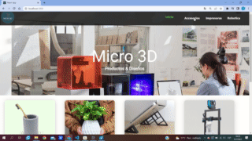

# Ecommerce - Micro3d

## Empezar con la aplicacion 

´´´bash
$ git clone https://github.com/gaspigon/reactMicro
$cd microReact
$npm install
$npm
´´´
## Gif de la aplicacion

## Contenido de la Aplicacion

Ecommerce destinado a ventas de productos en 3D e impresoras.

las rutas que lo componen esta determinadas por categorias
Accesorios: distintos accesorios 3d
Impresoras: 2 impresoras 3d de alta gama y detalles
Robotica: venta de robot otto.

## Enviroment Varibales

//FirebaseConfig:

See ['.env.example'](https://github.com/gaspigon/reactMicro/main/.env.example)

El documento del producto para configurar credenciales de firebase

### `npm start`

Runs the app in the development mode.\
Open [http://localhost:3000](http://localhost:3000) to view it in your browser.

The page will reload when you make changes.\
You may also see any lint errors in the console.

